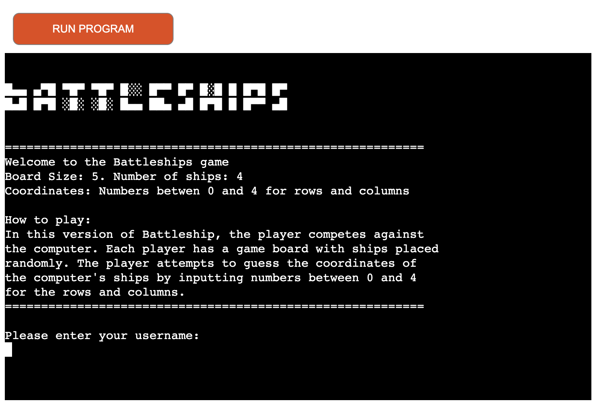
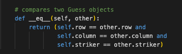

# Battleships-game
The Battleship game is the third Portfolio project for Diploma in Full Stack Software Development at Code Institute.
This is a digital version, written int Python, of the well known board game Battleship. The scope of the game is to input coordinates in order to hit the enemies ships until one of the players successfully strikes all of the opponent’s ships. 

You can find the live link here: [Battleships-game](https://battleships-game.herokuapp.com/)

___

# Table of Contents

- [Overview](#Overview)
    * [Project](#Project) 
    * [How to play](#how-to-play)
 - [Structure](#structure) 
    * [Start screen](#start-screen) 
    * [Game Board](#game-board)
    * [Score](#score)  
    * [End of the Game](#end) 
    * [Future Scope](#future-scope)   
- [Data model](#data-model)
    * [Description](#description)
- [Testing](#testing)
    * [Validator Testing](#validator-testing)
    * [Manual Testing](#manual-testing)
- [Deployment](#deployment)
- [Technologies](#technologies) 
- [Bugs](#bugs)
- [Credits](#credits)

---

# Overview
  ## Project
  The game starts with a welcoming introduction and explanation of the rules.
  In this case, the game board is represented by a 5x5 grid where '-' represents an empty cell, '@' represents a ship, '$' represents a hit, and 'X' representsa miss.
  The player don’t need to select where to allocate the ships, as they are randomly assigned.

  The user is asked to enter the name before the game can start. 

  When the game starts, the player is presented with their new board on which the ships are indicated with the symbol “@“ . The computer’s board, on the other hand, only displays blank spaces .The objective of the game is to strategically select the cell that might contain the opponent’s ships. 
  To select the cell, the user must input the coordinates by indicating a row number and a column number. 

  If the ship has been successfully hit by one of the players it will be indicated with the symbol “ $”, otherwise it will be marked with an “X”. 
  The game concludes when one player sinks all of the opponent ships. 

  ## How to play
  In this version the player competes against the computer. Each player has a game board with ships placed randomly. The player attempts to guess the coordinates of the computer’s ships by inputting numbers between 0 and 4 for rows and columns.

# Structure
  ## Start screen
  - A logo created by symbols 
  - Welcome message and game information
  - Explane how to play the game
  - Prompt for the player's username.
   
  

  ## Game Board
  ### Battlefields
  - Player and Computer's battlefield boards
  - Ships are randomly placed in both boards
  - The ships on the computer board are hidden.
  - Prompt for input of coordinates.
    - Ask the player to guess a row
    - ask the player to guess a column

  

  ## Score
  - whether the player or computer hit or missed a ship
  - Display their scores.
  - Create new boards, with the choices made by the player or computer displayed on them.

  

  ## Input validation
  - player should choose a number only between 0 and 4!

  

  - Player cannot guess a coordinate twice
  
  

  ## End of the Game
  - Announce the winner of the game.
  - Display the final scores
  - Ask the player if they want to play again.
    - yes - restart the game
    - no - thanking them for playing the game.

  

  ## Future Scope
  In future updates of the game, players will have the option to select the size of the board, the number of ships and how to place them on the board. Additionally, the game will support multiple players.

# Data model
## Description
The code defines global variables `NUMBER_OF_SHIPS` and `BOARD_SIZE` that are used to set the number of ships on the board and the size of the board respectively.

The code consists of three main classes: Guess, Board, and Game: 

1- The Guess class is used to hold information about a player's guess. Each guess consists of a row, column, and striker (the player or computer). 
- It has a `--eq--()` method that compares two Guess objects.

2- Board class is used to create two boards for the player and the computer with randomly placed ships and empty spaces.  It has several methods:
- `print_grid()` method that prints the board.
- `init_board()` method that randomly creates coordinates for NUMBER_OF_SHIPS on the board.
- `add_guess_to_grid()` method that takes a guess object as input, checks if it hits a ship, updates the grid, and returns a boolean indicating whether the game has ended.
- `is_game_finished()` method that returns true if there are no ships left on the board, indicating the game is over. 

3- The Game class is used to control the flow of the game. It has a guesses attribute that is a dictionary where the keys are the players name and the value is a list of Guess objects.  It has several methods:
- `start()` method that initializes the game board, ask player for guesses until the game is over, generate random guesses for computer, update the game boards and when the ships of whether player are over annunce the game winner.
- `__show_score()` that shows updated score of the player or the computer based on whether they have hit a ship or missed. 
- `__take_valid_input()` that verify if the player's input is a valid number between 0 and BOARD_SIZE-1 respectively.
- `__show_game_exit_menu()` and  "__reset()" to ask player if they want to play again and regenerate the game again.

# Testing
  ## Validator Testing
[PEP8CI](https://pep8ci.herokuapp.com/) has been used to automatically check and ensure that Python code adheres to the recommended style guidelines.

  

  ## Manual Testing

| Test Case | Input | Expected result | Outcome |
|-----------|:-------:|-----------------|:--------:|
|Please enter your username:|"Player1"|Valid input|Pass|
|Please enter your username:|"777"|Valid input|Pass|
|Please enter your username:|" ", empty|User input can not be empty! Please enter your username:|Pass|
|Guess a row:  Guess a column:|"0", "1", "2", "3", "4"|Valid input|Pass|
|Guess a row:  Guess a column:|"5", "9"|Please enter a number between 0 and 4!|Pass|
|Guess a row:  Guess a column:|" ", empty|Please enter a number between 0 and 4!|Pass|
|Guess a row:  Guess a column:|"word","A", "w"|Please enter a number between 0 and 4!|Pass|
|Do you want to play again?|"yes", "y"|Valid input,|Pass|
|Do you want to play again?|"no", "n"|Valid input|Pass|
|Do you want to play again?|" ", empty|Invalid input. Please enter (yes/y or no/n)|Pass|
|Do you want to play again?|"0", "1", "22", "50"|Invalid input. Please enter (yes/y or no/n)|Pass|
|Do you want to play again?|"word", "A", "w"|Invalid input. Please enter (yes/y or no/n)|Pass|
|Do you want to play again?|"@", "/", "*"|Invalid input. Please enter (yes/y or no/n)|Pass|

# Deployment
The site has been deployed on Heroku by following these steps:
1. Push most up-to-date code to Github
2. Create a list of requirements by typing the following into the terminal: pip3 freeze > requirements.txt and then push the requirements to Github
3. Login to Heroku
4. From the dashboard click the “Create new app” button
5. Name the app. The name has to be unique
6. Select your region  
7. Click “Create App”
8. A page with all the information to set up the app will open, click on the “Setting” tab on the top
9. Scroll down to the section “Config Vars”
10. Create a "Config VAR" with the key of 'PORT' and value of '8000'
11. Add buildpacks to our application by clicking “Add build pack”
12. Select “Python” as a first build pack, and click “Save changes”.
13. Add another build pack, called “Node.js”  and Click save
14. Make sure the build pack are in order (python on the top, node.js on the bottom)
15. Go to the top of the page and select the tab “Deploy”
16. In the section 'Deployment method', select 'Github', after that  you click on the button “Connect to Github”
17. Enter the repository in Github to connect to and click 'Search'
18. Once you find the repository, Click “connect” to link the app to Github repository
19. Scroll down to  'Automatic deploys', select the 'Enable Automatic Deploy' option
20. Go to Manual Deploy and click on “Deploy Branch”
21. Wait for the app to build and then click on the "View" link.

# Technologies
- Languages: 
  - Python
- Platform: 
  - Heroku

# Bugs
### Problem:
Some of the computer's guesses were not displayed on the board after the selection of coordinates section.

### Solution:
I fixed it by one line code:

# Credits
- [Fsymbols](https://fsymbols.com/generators/) provides a variety of different symbol generators, including text symbols that has been used to create a temporary logo for the game.

- [stackoverflow](https://stackoverflow.com/questions/) helped me to learned a lot about methods and loops in Python. I also discovered how to clear the interpreter console using `os.system()` and about the `__eq__` method  which was particularly useful for this project.

[Back to Top](#)

---

